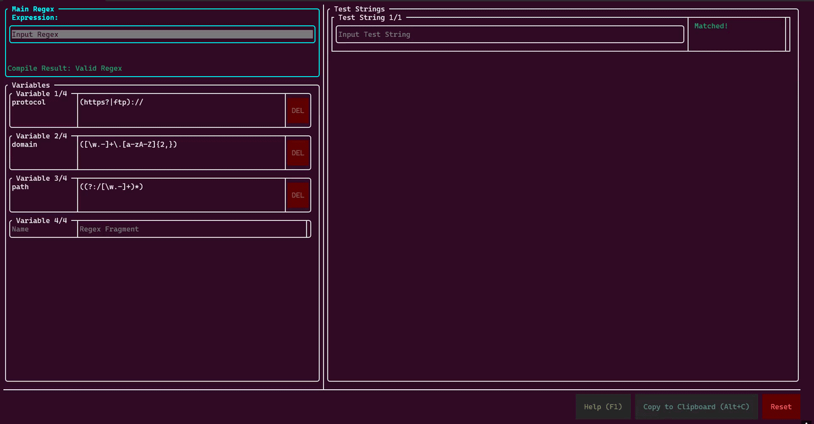

# Retui



## Overview
正規表現のマッチング処理をリアルタイムに検証するTUIアプリ。

## Requirement
- C++20対応コンパイラ
- CMake

## Usage
1. 実行ファイル（`retui` または `retui.exe`）を起動。
2. 変数の定義（左下）: 左側の「Variables」ペインによく使う正規表現の断片を変数として定義。
3. 正規表現の入力（左上）: 「Main Regex」に検証したい正規表現を入力。`{{変数名}}` の形式で、定義した変数を展開できます（エスケープしたい場合は `\{\{` と `\}\}` を使用）。
4. テストの実行（右側）: 右側の「Test String」ペインにテストしたいテキストを入力すると、リアルタイムにマッチ結果とキャプチャグループが表示。

## Features
- キーボード操作のみで完結
- リアルタイムな正規表現のマッチング・キャプチャグループの検証
- 変数機能による正規表現の部品化と再帰展開
- 複数のテスト文字列に対する同時評価
- Windows と Linux に対応
- クリップボードコピーのショートカット
- 終了時の状態自動保存と復元

## Controls
- `Tab` / `Shift+Tab`: 入力項目のフォーカス移動
- `Alt + H/J/K/L` または `矢印キー`: ペイン（コンテナ）間の移動
- `Enter` : ボタンの押下
- `Alt + C`: フォーカスしているテキスト（正規表現は展開後の文字列）をクリップボードにコピー
- `F1`: ヘルプモーダルを開く

## State Saving
アプリ終了時に、入力された正規表現・変数・テスト文字列は自動的に実行ディレクトリの `retui.json` に保存されます。  
次回起動時には、このファイルから状態が復元されます。  
すべて初期化したい場合は画面下部の `Reset` ボタンをご利用ください。

## Build
```bash
cmake -B build
cmake --build build --config Release
```

## Author
たまごすし
